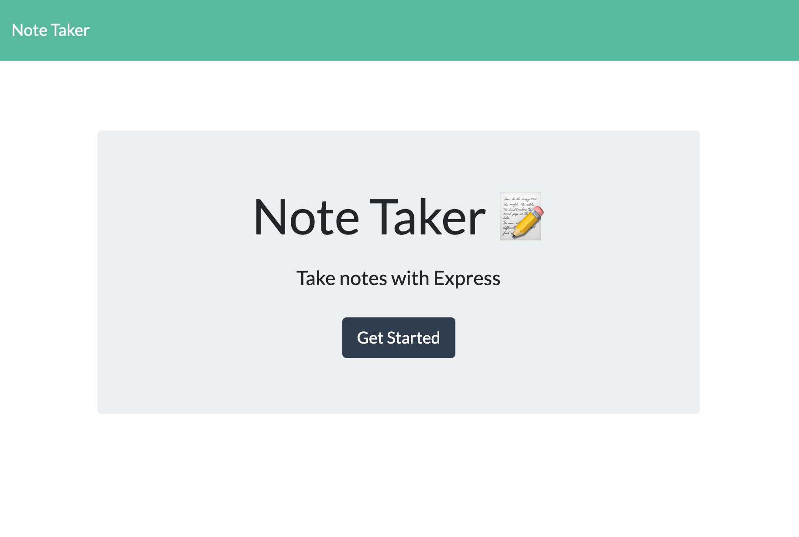
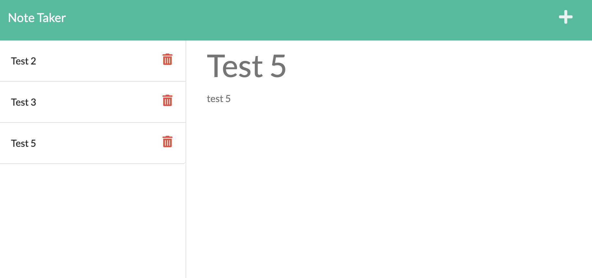

# Note Taker #

## Objective ##

>This was my first project using Express to implement a server. Since my focus was the routing and endpoints, the application doesn't utilize any sophisticated database software. Instead it uses node's File System module to simply rewrite the db.json file whenever the user input results in a post or delete request.
 
## Challenges

>The main challenge in this project was developing a detailed understanding of the starter code so that in adding new features I was fully leveraging the existing code and not reinventing the wheel. Also, I briefly struggled with how to assign unique IDs to the note entries upon creation. My first instinct was an integer counter. But that was unintuitive to implement. Eventually I settled on Math.random() which worked like a charm.

## Built with:

* HTML
* CSS
* Javascript

## Website:

[Visit the site on Heroku.]()

## Here are screenshots of the finished page:

## Video demo of the application's behavior:

[Video of the application's behavior]()

## License

> Naturally, I have not included a license for this simple exercise. :)

## Contributions:

>Made with ❤️ by Jonathan Price with starter code from the UCF coding bootcamp.